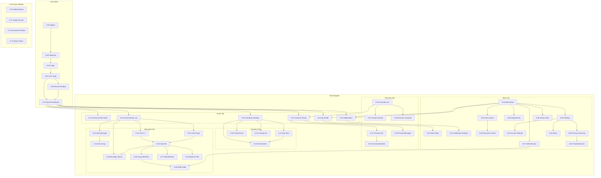

# NHL Connect - Navigation Map

## Overview

Complete navigation flow diagram for every screen in the app. This document ensures zero dead ends - every screen has a clear path in and out.

---

## Visual Navigation Flow

---

## Screen Accessibility Matrix

This table maps every screen's entry points and exit points:

| Screen | Entry From | Exits To |
|--------|-----------|----------|
| **S-01** Splash | App launch | S-02 (unauth) or S-10 (auth) |
| **S-02** Welcome | S-01 | S-03 |
| **S-03** Login | S-02 | S-02 (back), S-04 (submit) |
| **S-04** OTP | S-03 | S-03 (back), S-10 (success), S-05 (new device) |
| **S-05** Device Pending | S-04 | S-02 (logout), S-10 (approved) |
| **S-10** Home | Auth success, Tab select | S-12, S-20, S-21, S-22, S-31, S-40, S-42, S-51, S-53 |
| **S-12** Announcement | S-10, S-53 | S-10 (back), S-72 (attachment) |
| **S-20** Conversations | Tab select, S-10 | S-21, S-22, S-23, S-29 |
| **S-21** Chat 1:1 | S-20, S-59, S-10 | S-20 (back), S-25, S-71 |
| **S-22** Chat Group | S-20, S-10 | S-20 (back), S-25, S-71 |
| **S-23** New Message | S-20, S-11 | S-20 (cancel), S-21 (select 1), S-24 (select 2+) |
| **S-24** New Group | S-23 | S-23 (back), S-22 (create), S-27 (add members) |
| **S-25** Chat Info | S-21, S-22 | S-21/S-22 (back), S-26, S-27, S-28, S-29, S-59 |
| **S-26** Group Members | S-25 | S-25 (back), S-59 |
| **S-27** Add Members | S-25, S-24 | S-25/S-24 (back/done) |
| **S-28** Media & Files | S-25 | S-25 (back), S-71, S-72 |
| **S-29** Message Search | S-20, S-25, S-31 | Previous (cancel), S-21/S-22/S-31 (result tap) |
| **S-30** Channels | Tab select | S-31, S-34, S-35 |
| **S-31** Channel Thread | S-30, S-10, S-58 | S-30 (back), S-32, S-36, S-29, S-59 |
| **S-32** Channel Info | S-31 | S-31 (back), S-33, S-28, S-29, S-36 |
| **S-33** Channel Members | S-32 | S-32 (back), S-59 |
| **S-34** Create Channel | S-30 | S-30 (back), S-31 (created) |
| **S-35** Discover Channels | S-30 | S-30 (back) |
| **S-36** Pinned Messages | S-31, S-32 | Previous (back) |
| **S-40** Schedule | Tab select, S-10 | S-41, S-42, S-43, S-44 |
| **S-41** Day View | S-40 | S-40 (back), S-42 |
| **S-42** Event Detail | S-40, S-41 | S-40/S-41 (back), S-43 (edit), S-59 |
| **S-43** Create Event | S-40, S-42 | S-40 (back/save) |
| **S-44** Training List | S-40 | S-40 (back), S-42 |
| **S-50** More | Tab select | S-51-S-65 |
| **S-51** Profile | S-50, S-10 | S-50 (back), S-52, S-73 |
| **S-52** Edit Profile | S-51 | S-51 (back/save) |
| **S-53** Notifications | S-50, S-10 | S-50 (back), S-54, S-21, S-31, S-42, S-12 |
| **S-54** Notification Settings | S-53, S-60 | Previous (back) |
| **S-55** Files & Docs | S-50 | S-50 (back), S-56 |
| **S-56** Document Viewer | S-55, S-28 | Previous (back) |
| **S-57** Staff Directory | S-50, S-11 | S-50 (back), S-59 |
| **S-58** Departments | S-50 | S-50 (back), S-57 (filtered), S-31 |
| **S-59** Staff Profile | S-57, S-26, S-33, S-31 | Previous (back), S-21 (message) |
| **S-60** Settings | S-50 | S-50 (back), S-54, S-61, S-62, S-64 |
| **S-61** Account Settings | S-60 | S-60 (back) |
| **S-62** Privacy & Security | S-60 | S-60 (back), S-63 |
| **S-63** Trusted Devices | S-62 | S-62 (back) |
| **S-64** About | S-60 | S-60 (back) |
| **S-65** Admin Panel | S-50 | S-50 (back) |
| **S-70** Global Search | Any (via search icon) | Dismiss, navigate to result |
| **S-71** Image Preview | S-21, S-22, S-28, S-31 | Close to previous |
| **S-72** Doc Preview | S-55, S-28, S-12 | Close to previous |
| **S-73** Status Picker | S-51 | Dismiss to S-51 |

---

## Cross-Tab Navigation

Some screens are accessible from multiple tabs. These cross-tab navigations:

| Action | From | To |
|--------|------|----|
| Tap unread message on Home | Home tab | Messages tab → S-21 |
| Tap channel pill on Home | Home tab | Channels tab → S-31 |
| Tap schedule card on Home | Home tab | Schedule tab → S-42 |
| Tap notification (message) | More tab → S-53 | Messages tab → S-21 |
| Tap notification (channel) | More tab → S-53 | Channels tab → S-31 |
| Tap notification (schedule) | More tab → S-53 | Schedule tab → S-42 |
| Tap "Message" on Staff Profile | More tab → S-59 | Messages tab → S-21 |

---

## Deep Link Routes (future)

For future push notification deep linking:

| Route | Screen |
|-------|--------|
| `/chat/:conversationId` | S-21 or S-22 |
| `/channel/:channelId` | S-31 |
| `/event/:eventId` | S-42 |
| `/announcement/:id` | S-12 |
| `/notifications` | S-53 |
